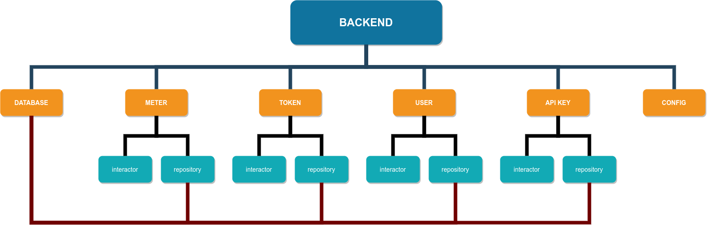

# ATS 

This hosts code for Automated Token System

Folder structure  
/app containes server-side code  
/assets holds all raw digital assets created for this project  
/cmd is the entry point to the server  
/config allows different configs to be loaded during initialization, the most important one being db urls  
/frontend contains raw code for the client webapp  
/frontend/public contains compiled code for the client webapp

Infrastructure  
Backend: GoLang (Hosted on Heroku)  
FrontEnd: angular/javascript, SPA  
API: GraphQL  
WebHooks: (GraphQL, JSON, REST) either  
Database: MongoDB (Hosted on Atlas)  
Design Concept: (Domain Driven Design + Test Driven Design), Agile

Golang DDD structure:
The entry point  
Main Types:  
meter  
token  
user

Every type is isolated in it's own package  
Every package associated with these types has 2 go files: interactor and repository  
Respository contains a private pointer to the database implementation, as well as methods of all the possible operations on this type  
This allows for the package to implement the database locally, and the only externally visible methods are the operations.  
Interactor contains all the higher-level abstractions of the possible operations that might include interacting with other packages.  
This allows for inter-package communication as well as grouping several operations into one function. The same method might be visible from different packages  
There is one shared database implementation that is shared across all the packages.

# Authentication

Factors we considered:

1. The user-base is small, but needs to be scalabble
2. We need to have some control over the user signup
3. Simplicity is the ultimate sophistication (~Einstein)

The original plan was to have contol over the entire stack, but since **efficient and secure** auth by itself is a very broad and complex, we decided to combine firebase auth and mongo.  
Merits:

1. Secure auth on-the-fly
2. Rich API
3. Generous free tier
4. We can leverage on the free hosting as well (Hence leave backend to host API ONLY)
5. The backend retains full control

# Logic

# Creating A Sample Token

Obtain the Active API-Key from the dashboad  
Run on the terminal  
`curl --request POST \ --url https://atske.herokuapp.com/token \ --header 'Authorization: [API KEY]' \ --header 'Content-Type: application/json' \ --data '{ "meterNumber": "[TARGET METER NUMBER]", "tokenString": "[TOKEN]" }'`

Replace [API KEY] With the value obtained from the dashboard  
Replace "https://atske.herokuapp.com/token" with "http://localhost:4242/token" if your server is srunning locally  
Replace [TARGET METER NUMBER] with the meter number
Replace [TOKEN] with the token Number

If you get the response "Success" the operation was successful, hence refresh your page and the token should shouw up.  
Otherwise, please NOTE:

1.  Token number cannot repeat
2.  Meter Number MUST be valid one
